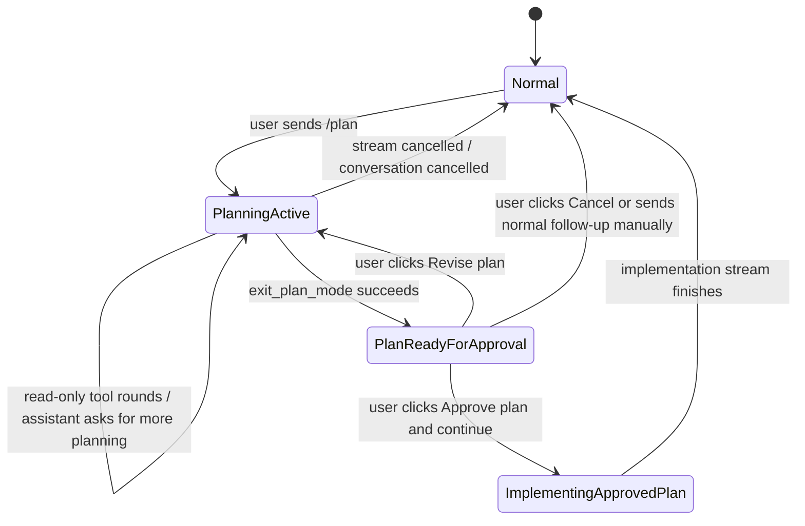

# M8.1: Plan Mode Auto-Implement Approval

## Summary

Add a local-only approval transition after `exit_plan_mode`: when the local agent finishes a plan, Warp should show an explicit `Approve plan and continue` affordance. If the user approves, Warp sends a normal-mode follow-up in the same conversation so the agent can implement the approved plan using the existing normal-mode tool approval policies. If the user rejects, Warp must leave a clear non-implementing path.

This is a continuation of M4.2 plan mode. M4.2 made planning safe by enforcing a read-only tool policy and making `exit_plan_mode` stop without executing changes. M8.1 should keep that safety boundary and add only the user-approved transition into implementation.

## User Story

As a Warp user, I want `/plan` to produce a reviewable plan and then let me approve implementation with one click, so I do not have to copy the plan into a new prompt while still keeping explicit control over when changes begin.

## Current State

M4.2 plan mode is currently request-scoped from the user input mode:

- `app/src/ai/agent/local/mod.rs:493` defines the plan-mode system prompt.
- `app/src/ai/agent/local/mod.rs:502` derives `LocalToolPolicy::Plan` from `AIAgentInput::UserQuery { user_query_mode: UserQueryMode::Plan }`.
- `app/src/ai/agent/local/mod.rs:1757` advertises read-only tools plus `exit_plan_mode` when plan mode is active.
- `app/src/ai/agent/local/mod.rs:2428` dispatches the `exit_plan_mode` local tool.
- `app/src/ai/agent/local/mod.rs:2904` validates the plan and returns assistant-visible text.
- `app/src/ai/agent/local/mod.rs:964` handles a successful `exit_plan_mode` by emitting the plan text, adding the tool result to local OpenAI history, finishing the stream, and returning.

There is no persisted pending-approval state today. The current final copy says:

```text
No changes were executed. Review the plan and send a normal follow-up when ready to proceed.
```

That is safe, but it leaves the user to manually write the follow-up.

The existing follow-up path already preserves conversation identity:

- `app/src/ai/blocklist/controller.rs:636` keeps `WhichTask::Task { conversation_id, task_id }` when sending into an existing conversation.
- `app/src/ai/blocklist/controller.rs:670` extracts `/plan` mode from the submitted text; a plain follow-up is normal mode.
- `app/src/ai/blocklist/controller.rs:1001` exposes `send_user_query_in_conversation`.
- `app/src/terminal/input.rs:13228` sends typed follow-ups to the selected conversation id.
- `app/src/terminal/view/agent_view.rs:236` uses the same controller entry point for Agent View auto-submit.

Existing UI primitives can help but should not be reused as-is:

- `app/src/ai/blocklist/block.rs:2100` has a reusable keyboard-navigable two-button helper.
- `app/src/ai/blocklist/block.rs:1958` uses that helper for `SuggestNewConversation`.
- `RunAgentsCardView` is richer and agent-orchestration specific.
- `AskUserQuestion` is model-tool driven and should not be used for approving a local state transition.

## Proposed Changes

### 1. Plan Approval State

Introduce a local plan approval state owned by the conversation/controller layer, not by the prompt. A concrete shape can be adjusted during implementation, but the semantics should be:

```rust
pub struct PendingPlanApproval {
    pub plan: String,
    pub summary: Option<String>,
    pub source_exchange_id: AIAgentExchangeId,
    pub source_message_id: MessageId,
}
```

Recommended ownership:

1. Store the pending state on `AIConversation`, because it belongs to a conversation and must survive block re-rendering, Agent View toggles, and active-block changes.
2. Expose mutation helpers through `BlocklistAIHistoryModel` or `AIConversation` methods:
   - `set_pending_plan_approval(conversation_id, pending)`
   - `pending_plan_approval(conversation_id)`
   - `clear_pending_plan_approval(conversation_id)`
3. Persistence across app restart is not required for V0. If persistence is cheap, it may be added, but do not block V0 on DB migration.

The state is local runtime/application state. Do not add prompt-visible `AIAgentContext` for "plan approved" or "plan pending". The implementation request after approval can include an ordinary user message containing the approved plan.

### 2. Emit Plan-Ready Metadata From `exit_plan_mode`

Keep the M4.2 executor policy intact: `exit_plan_mode` still terminates the plan-mode tool loop and no mutating tool can run in the same provider round.

Change the successful `exit_plan_mode` path so the app can distinguish "plain text" from "plan ready":

1. Parse and validate `plan` and `summary` into a structured local result, not only a `String`.
2. Continue emitting assistant-visible plan text so history and transcripts remain readable.
3. Emit or record enough metadata to attach `PendingPlanApproval` to the current conversation/exchange.
4. Finish the stream immediately after the plan is surfaced.

The exact transport is implementation-owned. Preferred direction: extend the local tool execution result for `exit_plan_mode` with a `PlanReadyForApproval` payload, then have the local stream/controller convert it into conversation state and a UI action. Avoid fragile parsing of the rendered text.

### 3. Approval UI

Render a small inline plan approval control after the plan output when `pending_plan_approval` exists for that conversation:

- Primary action: `Approve plan and continue`
- Secondary action: `Revise plan`
- Optional tertiary action if cheap: `Cancel`

Recommended V0 behavior:

1. `Approve plan and continue` clears the pending approval and sends a normal follow-up in the same conversation:

   ```text
   Implement the approved plan below. Follow the plan unless new information makes a step unsafe or impossible; if that happens, stop and explain before making further changes.
   Do not call spawn_subagent or start a nested plan-mode flow for this implementation unless the user explicitly asks for that in a later message.

   <approved plan>
   ```

2. `Revise plan` clears the pending approval and sends a plan-mode follow-up in the same conversation, for example:

   ```text
   /plan Revise the previous plan. The user did not approve it. Address the user's latest concerns before proposing a new plan.
   ```

   If no user-provided revision text is available in V0, the follow-up can ask the agent to ask what should change, but it must be `UserQueryMode::Plan`.

3. `Cancel` clears the pending approval and sends no provider request. If V0 omits a separate cancel button, `Revise plan` must still provide the explicit reject path, and manual user input remains available.

Use the existing keyboard-navigable button pattern where possible, but define plan-specific actions/events rather than overloading `SuggestNewConversation`, `RunAgentsCardView`, or `AskUserQuestion`.

### 4. State Machine

Use this state machine for implementation and tests:



Important invariants:

1. `PlanningActive` is enforced by `LocalToolPolicy::Plan`, not prompt copy.
2. `PlanReadyForApproval` must be reachable only from a successful `exit_plan_mode` result.
3. `ImplementingApprovedPlan` is a normal request in the same conversation, not a special tool policy.
4. The model cannot self-transition from `PlanReadyForApproval` to implementation; only a local user event can approve.
5. A typed normal follow-up while a plan is pending is treated as normal user intent and clears the stale pending approval before sending. It must not be silently rewritten as an approved plan.

### 5. Normal-Mode Approval Policies Still Apply

After approval, the implementation request must use normal mode:

- `LocalToolPolicy::Normal`, not plan mode.
- Existing file-write gates and tool implementations apply.
- Existing `run_shell_command` command card, M6.1 autoexecute allowlist, and shell fail-closed behavior apply.
- Existing MCP tool approval/result flow applies.
- Existing web/file tool feature flag checks apply.

Do not create an "auto-approve all plan steps" execution profile. The approval authorizes the mode transition and prompt, not arbitrary tool execution.

## Acceptance Criteria

1. `exit_plan_mode` still validates non-empty bounded `plan` and bounded optional `summary`.
2. `exit_plan_mode` still stops the current plan-mode provider loop immediately after surfacing the plan.
3. No mutating tool can run in the same tool batch or provider round after `exit_plan_mode`.
4. A successful `exit_plan_mode` records a pending plan approval for the same `AIConversationId`.
5. The pending plan approval is not created by assistant prose, only by the structured `exit_plan_mode` path.
6. The plan text remains visible in the conversation transcript.
7. The UI renders an `Approve plan and continue` control when the current conversation has pending plan approval.
8. Clicking `Approve plan and continue` sends a follow-up to the same `AIConversationId`.
9. The approval follow-up is normal mode; it does not include `/plan` and does not set `UserQueryMode::Plan`.
10. The approval follow-up includes the approved plan text so the provider has the implementation context.
11. The pending approval is cleared before or atomically with sending the approval follow-up, so double-clicking cannot submit duplicate implementation requests.
12. Clicking `Revise plan` or the chosen reject action does not start normal-mode implementation.
13. The reject path either sends a plan-mode revision follow-up in the same conversation or clears/cancels the pending state with no provider request; the implemented behavior must be explicit and tested.
14. A typed normal follow-up while a plan is pending preserves existing user-authored behavior and does not masquerade as clicking approve.
15. Conversation id remains unchanged across `/plan` → `exit_plan_mode` → approval → implementation.
16. Normal-mode shell approvals and M6.1 autoexecute behavior still apply during implementation.
17. Normal-mode file write approvals/guards still apply during implementation.
18. Normal-mode MCP approvals and result pairing still apply during implementation.
19. Plan mode safety tests from M4.2 still pass.
20. Existing local-agent history pairing tests from PR #39 still pass after approval-triggered implementation and follow-up turns.

## Testing And Validation

Required focused tests:

1. `exit_plan_mode` returns a structured plan-ready payload and assistant-visible plan text.
2. `exit_plan_mode` sets pending plan approval for the same conversation id.
3. A malformed or oversized `exit_plan_mode` call does not set pending approval.
4. Plan-mode direct calls to mutating tools remain denied after the M8.1 changes.
5. A mixed tool batch stops at `exit_plan_mode` and does not execute later mutating tool calls.
6. Rendering logic shows approval controls only for conversations with pending plan approval.
7. Approval action clears pending approval and calls `send_user_query_in_conversation` with the original conversation id.
8. Approval follow-up is parsed as `UserQueryMode::Regular` or equivalent normal mode.
9. Reject/revise action clears pending approval and either sends a `/plan` follow-up or sends no request, matching the chosen V0 behavior.
10. Double approval is idempotent: the second click does not submit a second implementation request.
11. User-typed normal follow-up while pending clears stale approval without injecting the approved-plan template.
12. Shell command approval/autoexecute tests still pass for normal implementation mode.
13. File write tool tests still pass for normal implementation mode.
14. MCP action result follow-up tests still pass after an approved plan implementation uses MCP.
15. Local-agent full focused suite still passes.

Suggested commands:

- `cargo test -p warp ai::agent::local:: -- --nocapture`
- `cargo test -p warp plan_mode_auto_implement -- --nocapture`
- `cargo test -p warp run_shell_command_tool_card -- --nocapture`
- `cargo test -p warp local_autoexecute_classifier -- --nocapture`
- `cargo test -p warp local_direct_history_pairs -- --nocapture`
- `cargo check -p warp --tests`
- `cargo clippy -p warp --tests -- -D warnings`
- `cargo fmt --check`
- `git diff --check origin/master...HEAD`

Manual e2e on an installed dogfood build is a hard gate:

1. Start Warp with local OpenAI-compatible agent configured through the trace proxy.
2. Send `/plan make a small safe edit`.
3. Confirm the agent can use read-only tools and cannot execute shell/file write/MCP tools while planning.
4. Confirm `exit_plan_mode` produces visible plan text and an approval control.
5. Click `Approve plan and continue`.
6. Confirm the next request uses the same conversation id in UI/history and provider trace.
7. Confirm the implementation request is normal mode and can request normal tools.
8. Confirm shell/file/MCP approvals still appear when required; M6.1 safe commands may autoexecute only if allowlisted.
9. Confirm a follow-up after implementation does not 400 and includes properly paired tool results.
10. Repeat with reject/revise and confirm no normal-mode implementation starts.

Source-level tests are not enough for this milestone. The full plan approval click path must be exercised in the installed app.

## Safety Risks And Mitigations

- Prompt injection auto-approve: the model may write "approved" in the plan. Mitigate by allowing approval only through a local UI event tied to pending state.
- Plan-mode safety regression: adding auto-implement could accidentally allow a mutating tool in the same plan round. Mitigate by keeping `exit_plan_mode` as a terminal result and testing mixed batches.
- Model deviates from approved plan: the implementation prompt should tell the model to follow the approved plan and stop if unsafe/impossible, but enforcement is bounded. Tool approval policies remain the hard guard.
- Conversation id drift: approval could accidentally create a new conversation. Mitigate by routing through `send_user_query_in_conversation` with the original id and testing provider trace/history.
- Duplicate implementation requests: double-clicks or rerenders could submit twice. Mitigate by clearing pending state before send and making approval idempotent.
- Stale plan after manual follow-up: the user may continue the conversation without clicking approval. Mitigate by clearing pending approval on any new user-authored query into that conversation.

## Scale Estimate

M/L. The local tool change is small, but the feature crosses the local provider stream, conversation state, AI block rendering, terminal/controller events, and e2e validation. Expect one compact implementation PR if the plan-ready payload can be threaded cleanly; split if UI state becomes larger than expected.

## PR Split

Preferred implementation split:

1. PR1: plan-ready structured result, conversation pending state, approval/reject controller actions, unit tests.
2. PR2: inline approval UI polish and e2e wiring.

A single implementation PR is acceptable if the diff stays compact and tests remain easy to review. The docs/spec PR should land first before implementation starts.

## Entry Points

- `app/src/ai/agent/local/mod.rs:493` — plan-mode prompt remains safety guidance.
- `app/src/ai/agent/local/mod.rs:502` — `LocalToolPolicy` remains the hard plan/normal policy switch.
- `app/src/ai/agent/local/mod.rs:964` — successful `exit_plan_mode` currently terminates the stream; add plan-ready metadata/state plumbing here.
- `app/src/ai/agent/local/mod.rs:2428` — `exit_plan_mode` tool dispatch.
- `app/src/ai/agent/local/mod.rs:2904` — plan validation.
- `app/src/ai/agent/conversation.rs:125` — recommended home for pending plan approval state on `AIConversation`.
- `app/src/ai/blocklist/history_model.rs:183` — expose conversation-state helpers.
- `app/src/ai/blocklist/controller.rs:1001` — approval should send implementation through existing conversation follow-up.
- `app/src/ai/blocklist/controller.rs:1088` — clear stale pending plan state on new user-authored conversation input.
- `app/src/ai/blocklist/block.rs:2100` — reusable keyboard-navigable button pattern.
- `app/src/ai/blocklist/block.rs:5560` and `app/src/terminal/view.rs:19406` — existing block event to terminal/controller routing pattern.
- `app/src/ai/blocklist/block/view_impl/output.rs:3179` — existing continue-conversation button rendering pattern.

## Non-Goals

- No automatic implementation without a user click.
- No broad auto-approval of shell, file write, MCP, or web tools.
- No prompt-visible "approval state" context.
- No cloud/Oz agent behavior changes.
- No persistence requirement for pending plan approvals across app restart in V0.
- No new execution profile or permanent autonomy setting.

## Parallelization

Do not parallelize the implementation across multiple agents initially. The state shape must be consistent across provider stream, conversation history, controller, and UI. If the implementation is split, PR2 can start only after PR1 settles the pending state and event API.
